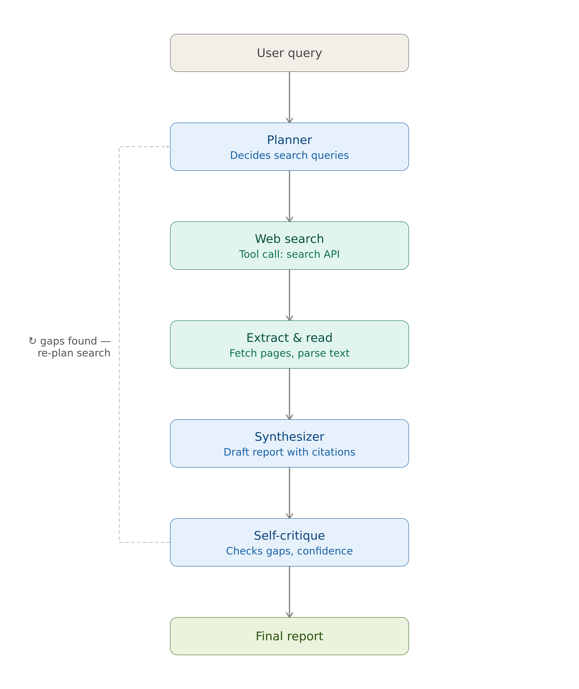

Plans a research strategy, searches the web, reads sources, cross-checks facts, and produces a cited report.
Demonstrates: planning, tool use, citation handling, self-critique loops.

Architecture



plan → search → read/extract → synthesize → self-critique → revise
Stack: Python, an LLM API (function calling), a search tool (Tavily/Serper/web scraping), simple orchestration with LangGraph.

The critic.py step makes this system agentic, by giving a confidence level and possible gaps.

# Research agent

A hand-rolled research agent: plan → search → extract → synthesize →
self-critique, looping back to planning when the critic finds gaps.

Built without an agent framework on purpose — the loop is ~40 lines in
`agent/orchestrator.py` and every step is a plain function, so the control
flow is fully inspectable rather than hidden behind a library abstraction.

## Architecture

```
User query
    |
    v
Planner  --------------------------+
    |                              |
    v                              |
Web search + extract               |
    |                              |
    v                              |
Synthesizer                        |
    |                              |
    v                              |
Self-critique --(gaps found)-------+
    |
    v (complete)
Final report
```

- **Planner** (`agent/planner.py`) — LLM call that turns the question (plus,
  on later rounds, critique feedback) into concrete search queries.
- **Tools** (`agent/tools.py`) — plain functions for web search (Tavily) and
  page extraction (requests + BeautifulSoup). No LLM calls here — these are
  unit-testable in isolation.
- **Synthesizer** (`agent/synthesizer.py`) — drafts a cited report from
  collected sources.
- **Critic** (`agent/critic.py`) — reviews the draft and decides whether to
  loop again or ship. This is the piece that makes it "agentic": the system
  decides for itself whether its own work is good enough.
- **Trace** (`agent/trace.py`) — logs every step with timestamps and token
  counts, and writes a JSON trace to `traces/<run_id>.json` per run.

## Setup

```bash
pip install -r requirements.txt
cp .env.example .env   # fill in ANTHROPIC_API_KEY and TAVILY_API_KEY
python cli.py "What are the main risks of quantum computing for RSA encryption?"    # query here
```

## Guardrails (and why they're here)

- **`MAX_PLAN_ITERATIONS` (default 3)** — hard cap on plan→search→critique
  cycles. Without this, a critic that's never satisfied would loop
  indefinitely and burn API budget. If the cap is hit, the report ships
  with an explicit note rather than silently presenting unfinished work
  as final.
- **`MAX_SOURCES_TOTAL` (default 15)** — caps total pages fetched per run,
  so a broad question can't spiral into fetching hundreds of pages.
- **Critic fails closed** — if the critic's JSON response can't be parsed,
  the run treats it as "complete" rather than looping forever on a
  malformed response.

## Known limitations

- The extractor is plain HTML parsing — no JS rendering, so it won't work
  on pages that render content client-side. Documented rather than hidden;
  a production version would add a headless-browser fallback.
- Tavily is the only search provider wired up. `tools.search_web` returns
  a plain `{title, url, snippet}` shape specifically so swapping providers
  doesn't touch the orchestrator.
- No persistent memory across runs — each `run()` call is independent.

## TODO

- Parallelize source fetching (currently sequential)
- Cache fetched pages by URL to cut cost on repeated runs
- A confidence threshold on individual claims, not just the draft overall
- Citation tracking (claims linked to sources)
- A "confidence check" step where it flags uncertain claims
- Cost/token logging per run
- A basic web UI with Streamlit